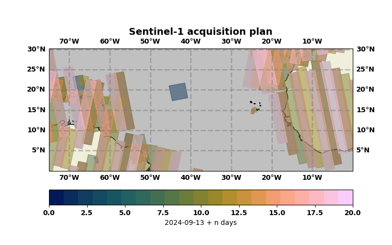

Repository containing sub projects directly related to ORCESTRA campaign

- `S1_acquistion`: downloads and visualizes the latest Sentinel-1 acquistion plan

## 1. Run Cronjob

Create the correct environment

```bash
conda create -n ENVNAME python=3.12
conda activate ENVNAME
```
Navigate to the correct directory

```bash
cd ORCESTRA
```
Install packages within `pyproject.toml`

```bash
pip install -e .
```

Run the Bash script `ORCESTRA/S1_acquisition/cron_task/task.sh` (and optionally set the cron update frequency in this file)

```bash
bash path/to/ORCESTRA/S1_acquisition/cron_task/task.sh
```

This will start a recurring cron job scheduled for 10 am every day that looks for and downloads/visualizes updated acquistion plans

## 2. Run manually

To run the script manually use

```bash
python path/to/ORCESTRA/S1_acquisition/src/file_download.py
```

To change the domain size or plotting settings you can modify parameters in either `visualisation.py` or `file_download.py` (ugly, I know).

Which will create a figure in the `figures` folder with, for example:

